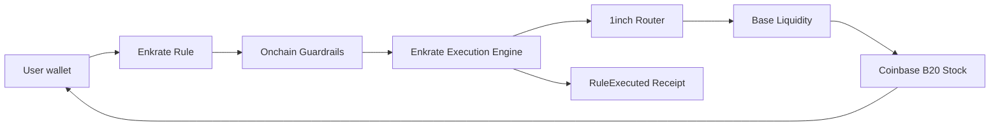

<div align="center">

# Enkrate

### Programmable execution with onchain guardrails.

**Set the rule once. Enkrate executes only inside the boundaries you defined.**

[](https://base.org)
[](https://blog.base.org/tokenized-stocks)
[](https://1inch.io/)
[](https://soliditylang.org/)
[](https://nextjs.org/)
[](https://www.typescriptlang.org/)
[](#verification)
[](LICENSE)

[](https://basescan.org/tx/0x28a4a5a47976626527ed58c4cd3b74753ed4ab0b9e95f5a473ace46abeefc7fb)
[](https://basescan.org/address/0x460BBb6f0064936E49A4458749575cC998a0db09)
[](https://basescan.org/address/0x57192cb77D0C5E659d25651CF3BBbbe6F2C4ecA4)

Built for the **Base Builder Quest — Coinbase Tokenized Stocks**.

</div>

---

## What is Enkrate?

Enkrate is a programmable execution layer for Coinbase Tokenized Stocks on Base.

A user defines a stock rule once — including the asset, spend amount, trigger price, reference-deviation limit, slippage limit, expiry, and 24-hour spend cap — and Enkrate will only allow execution when those constraints are satisfied.

The execution route can change dynamically. **The user's boundary cannot.**

> **Automation chooses the path. Your rule defines the boundary.**

Enkrate is not a brokerage, a custody vault, or an AI trading bot deciding what to buy. It is a guarded execution layer for deterministic stock actions.

---

## Why Enkrate?

Tokenized stocks make equities programmable onchain, but programmable access creates a second problem: **how do you automate execution without surrendering control?**

A naive automation system can rely too heavily on an offchain bot, grant broad approvals, execute at poor prices, route assets to the wrong receiver, or continue operating outside the user's intended limits.

Enkrate moves the critical boundaries onchain.

A rule can constrain:

- the exact Coinbase Tokenized Stock that may be purchased;
- the exact USDC amount used per execution;
- a 24-hour spend cap;
- a conditional trigger price or recurring interval;
- maximum reference-price deviation;
- quote slippage / minimum output;
- expiry;
- whether aged 24/5 reference data is allowed;
- the final stock receiver.

If an execution falls outside those constraints, it reverts atomically.

---

## How it works



### 1. Create a rule

The user chooses a supported B20 stock and defines the execution boundary.

For the hackathon MVP, Enkrate supports:

- **Conditional price rules** — e.g. buy NVDAc only at or below a chosen reference-price ceiling.
- **Recurring rules** — execute at a defined interval while all other guards remain satisfied.

### 2. Keep authorization bounded

The user grants Enkrate a finite USDC allowance. Enkrate pulls only the exact amount required by an eligible execution.

For the first live proof, the authorization was exactly **1 USDC**.

### 3. Validate the execution proposal

A server-side 1inch integration produces current routing calldata. Before that calldata can be executed, Enkrate validates protected fields such as:

- source token = USDC;
- destination token = the rule's registered B20 asset;
- amount = the rule's exact input amount;
- destination receiver = rule owner;
- router = canonical 1inch router;
- minimum return >= Enkrate's required output floor;
- execution/reference deviation inside the user's limit;
- execution price inside the conditional trigger.

### 4. Settle directly to the user

The purchased B20 stock is delivered directly to the rule owner.

Enkrate is designed for **zero persistent stock custody**.

### 5. Leave proof

A successful execution emits `RuleExecuted`, which powers the receipt UI and links directly to BaseScan.

Failed executions do not produce fake success receipts — they revert.

---

## Live Base Mainnet proof

Enkrate's core path has been executed successfully on Base Mainnet.

| Field | Result |
|---|---|
| Rule | Rule 2 — conditional NVDAc purchase |
| Input | **1.000000 USDC** |
| Output | **0.00445453 NVDAc** |
| USDC spent | `1,000,000` raw |
| NVDAc received | `445,453` raw |
| Engine USDC after | `0` |
| Engine NVDAc after | `0` |
| Engine → 1inch allowance after | `0` |
| Settlement | Directly to rule owner |
| Receipt | `RuleExecuted` emitted |
| Transaction | [View on BaseScan](https://basescan.org/tx/0x28a4a5a47976626527ed58c4cd3b74753ed4ab0b9e95f5a473ace46abeefc7fb) |

This was a real Base Mainnet execution — not a simulated trade.

---

## Deployed contracts

### Base Mainnet — Chain ID `8453`

| Contract | Address |
|---|---|
| `EnkrateAssetRegistry` | [`0x57192cb77D0C5E659d25651CF3BBbbe6F2C4ecA4`](https://basescan.org/address/0x57192cb77D0C5E659d25651CF3BBbbe6F2C4ecA4) |
| `EnkrateExecutionEngine` | [`0x460BBb6f0064936E49A4458749575cC998a0db09`](https://basescan.org/address/0x460BBb6f0064936E49A4458749575cC998a0db09) |

### Canonical infrastructure

| Component | Address |
|---|---|
| USDC | `0x833589fCD6eDb6E08f4c7C32D4f71b54bdA02913` |
| 1inch Router | `0x111111125421cA6dc452d289314280a0f8842A65` |
| NVDAc | `0xb20000000000000000000078ee7ce2fE4908108C` |
| AAPLc | `0xb200000000000000000000C2e324d24d7eEcd1fb` |

### Reference feeds

| Asset | Chainlink / Coinbase reference feed |
|---|---|
| NVDAc | `0x04689a41629776563E6822F76f2e57D148d28513` |
| AAPLc | `0x787f13dEa48Db0897CbCDD985de77809D837F988` |

---

## Guardrail model

Enkrate's execution engine enforces the rule rather than trusting a keeper or frontend assertion.

### Asset integrity

- Only registered canonical B20 assets are supported.
- B20 identity and initialization are checked.
- Coinbase/B20 transfer and corporate-action pause state are checked independently.

### Spending integrity

- Exact execution amount.
- Finite user authorization.
- Fixed/tumbling 24-hour spend window beginning at first spend.
- Rule expiry and lifecycle enforcement.

### Price integrity

- Chainlink/Coinbase reference data is read onchain.
- Conditional rules are enforced against **realized execution output**, not a keeper-supplied price.
- Minimum output is enforced.
- Reference deviation is bounded.
- Aged 24/5 reference data requires explicit user opt-in.

### Routing integrity

Enkrate allows 1inch to dynamically discover liquidity while constraining the parts a route must never change:

- source token;
- destination asset;
- amount;
- receiver;
- minimum output;
- router;
- conditional execution boundary.

### Custody integrity

After a successful execution:

- the user receives the B20 asset directly;
- Enkrate retains no purchased stock;
- unused USDC is not retained;
- temporary router allowance is reset to zero.

---

## Product experience

The current app includes:

- **Overview** — supported B20 assets, reference state, B20 status and wallet balances.
- **Rule Builder** — guided six-step rule creation with live reference context and bounded authorization.
- **Rules** — active rules, readiness states, spend windows, allowance state and manual guarded execution.
- **Receipts** — real `RuleExecuted` events with BaseScan links.
- **Global execution notifications** — successful executions surface across the app and automatically refresh relevant balances, allowances, rule state and receipts.
- **Playbooks** — reusable product patterns for future rule templates.

---

## Supported assets

The hackathon MVP intentionally keeps the asset surface small:

- **NVDAc** — NVIDIA Coinbase Tokenized Stock
- **AAPLc** — Apple Coinbase Tokenized Stock

The registry is extensible so additional verified B20 assets can be added without changing the core execution engine.

---

## Tech stack

- **Base Mainnet** — settlement and native B20 execution
- **Solidity 0.8.24** — execution engine and registry
- **Foundry + Base-patched Foundry** — unit and native B20 fork testing
- **Next.js** — application and server routes
- **TypeScript** — typed frontend/server logic
- **viem** — wallet and onchain reads/writes
- **1inch Classic Swap** — dynamic execution routing
- **Chainlink / Coinbase reference feeds** — stock reference data
- **Coinbase B20** — tokenized-stock primitive

---

## Repository structure

```text
.
├── contracts/
│   ├── src/
│   │   ├── EnkrateExecutionEngine.sol
│   │   ├── EnkrateGuard.sol
│   │   ├── EnkrateAssetRegistry.sol
│   │   ├── adapters/
│   │   └── interfaces/
│   └── test/
├── docs/
├── scripts/
├── src/
│   ├── app/
│   ├── components/
│   └── lib/
├── fork-harness/
└── README.md
```

---

## Run locally

### Prerequisites

- Node.js / npm
- Foundry
- A Base Mainnet RPC endpoint
- A 1inch API key for live proposal generation

### Install

```bash
npm install
cp .env.example .env
```

Fill the required values described in `.env.example`.

> Keep `ONEINCH_API_KEY` server-side only. Never expose it through a public browser environment variable or commit it to Git.

### Start the app

```bash
npm run dev
```

### Production checks

```bash
npm run lint
npm run typecheck
npm run build
```

### Contracts

```bash
forge fmt --root contracts --check
forge build --root contracts
forge test --root contracts
```

---

## Verification

The production execution core has been validated with:

- **27 / 27 Foundry tests passing**;
- TypeScript checks passing;
- ESLint passing;
- Next.js production build passing;
- Base-native B20 execution using official Base-patched Foundry tooling;
- real NVDAc and AAPLc fork execution paths;
- one successful real NVDAc execution on Base Mainnet.

Coverage includes:

- rule creation / cancellation / expiry;
- recurring interval enforcement;
- spend-window enforcement;
- canonical asset registry;
- B20 pause / policy checks;
- insufficient balance / allowance;
- 1inch calldata validation;
- receiver / asset / amount substitution rejection;
- minimum-output enforcement;
- conditional realized-price enforcement;
- reentrancy protection;
- zero persistent B20 custody;
- router allowance cleanup.

---

## Security model

Enkrate is intentionally narrow for the hackathon MVP.

It does **not** currently use:

- unlimited router approvals;
- a shared user-asset vault;
- keeper-controlled rule parameters;
- arbitrary execution targets;
- Permit2/session keys;
- autonomous AI decision-making.

The system prefers a small deterministic security surface over broad automation.

See [`docs/contracts.md`](docs/contracts.md) and [`docs/mainnet-reality-gate.md`](docs/mainnet-reality-gate.md) for deeper implementation evidence.

---

## Roadmap

After the hackathon, the same guarded execution engine can support richer ways to express intent without moving authority out of the contract.

Planned directions include:

- automated keeper execution for eligible rules;
- natural-language **“Describe a rule”** creation, with an LLM translating intent into the same structured rule for user review;
- additional Coinbase Tokenized Stocks;
- incoming-USDC / income-triggered stock actions;
- event-triggered execution;
- integrations with stock-backed credit and broader programmable-asset workflows.

The principle stays the same:

> **The interface may become smarter. The execution boundary stays deterministic.**

---

## Eligibility & disclaimer

Coinbase Tokenized Stocks are available only to eligible users in permitted jurisdictions outside the United States.

Enkrate does not determine a user's legal eligibility and is not a broker, investment adviser, or investment recommendation service. Users are responsible for confirming their own eligibility and reviewing every rule and transaction they authorize.

---

## Built for Base

Enkrate was built for the **Base Builder Quest: Coinbase Tokenized Stocks** to explore what becomes possible when equities are not just tokenized, but programmable.

The thesis is simple:

> Coinbase Tokenized Stocks make equities programmable on Base. **Enkrate makes that programmability controllable.**

---

## License

Released under the [MIT License](LICENSE).

---

<div align="center">

**Enkrate** — *Autopilot, within your rules.*

</div>
